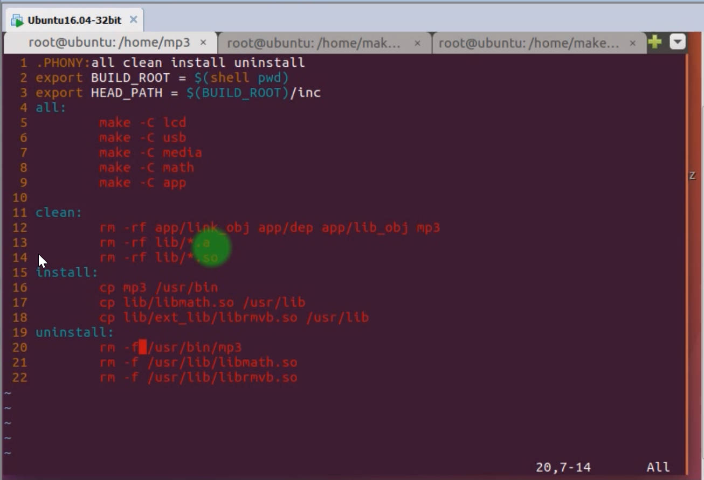

# 3.10-3.11 Makefile Install and Uninstall

Installation: Copy the generated library file to the corresponding file system

Write a config.mk ,when you wanna add new library to the exe, just add It's name in config. Then adjust the Makefile in root directory, make it to be : For dir in $(BUILD_DIR): , the (BUILD_DIR) in the file config.mk to iterate through the all file you wanna make the make file, equivalent to "make -C lcd"... 

