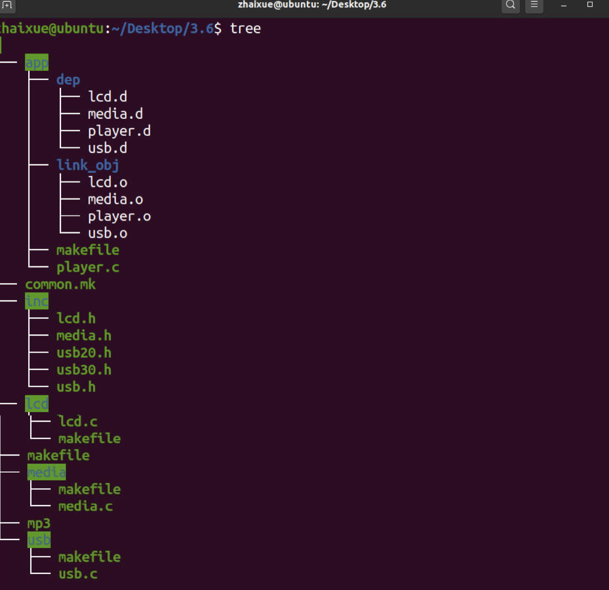
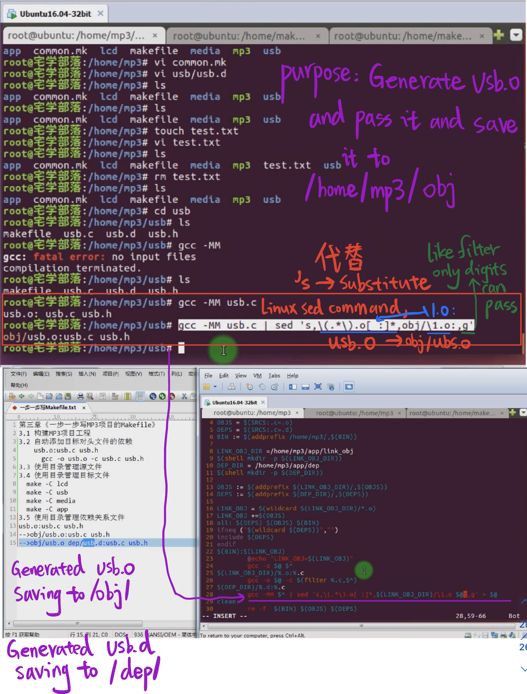

# 3.2-3.6 The generated files are saved to the corresponding directory

The code saved in the same work directory named "3.6"

The dependency tree of the file 3.6 after compiling 

As you can see, .o saved to the /app/link_obj, .d saved to /app/dep, and .h saved to the /inc

## Explain the saving sentence how to work in common.mk

