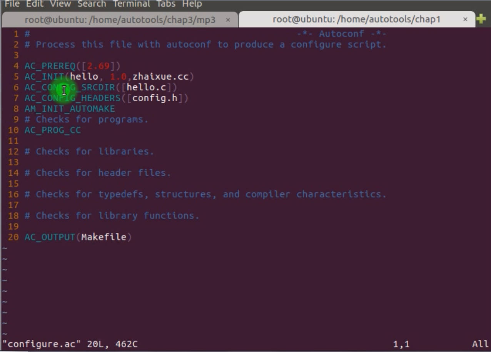

# 4.3 Use variables and macros to generate flat directory Makefile

## The variable and macro of Automake

| The extension to identify how to compile the file | Explain                                               |
| ------------------------------------------------- | ----------------------------------------------------- |
| _PROGRAMS                                         | Indicates that the build target is an executable file |
| _LIBRARIES                                        | Build target as library file                          |
| _LTLIBRARIES                                      | Generate library files using LIBTOOL                  |
| _HEADERS                                          | Head File                                             |
| _DATA                                             | Data files, configuration files, etc.                 |

| Compile Configuration | Explain                                                      |
| --------------------- | ------------------------------------------------------------ |
| _SOURCES              | Source files that the target depends on                      |
| _LIBADD               | Other libraries that need to be linked when generating the library |
| _LDADD                | Linking libraries that need to be linked                     |
| _LDFLAGS              | Linking option:-I /-L/-shared/-fPIC                          |
| _LIBTOOLFLAGS         | Libtool option flags                                         |

| Path Variable   | Value                           |
| --------------- | ------------------------------- |
| bindir          | $(prefix)/bin                   |
| libdir          | $(prefix)/lib                   |
| datadir         | $(prefix)/share                 |
| sysconfdir      | $(prefix)/etc                   |
| includedir      | $(prefix)/include               |
| $(top_srcdir)   | Project top-level directory     |
| $(top_builddir) | Target file top-level directory |
| noinst          | Not install on the usr/lib      |

| Other Variables | Explain                          |
| --------------- | -------------------------------- |
| INCLUDES        | Link needed head files           |
| SUBDIRS         | Recursively process subdirectory |
| EXTRA_DIST      | Package file or directory        |

## The Grammar of Configure.ac

 

| Macro             | Explain                                                      |
| ----------------- | ------------------------------------------------------------ |
| AC_INIT           | ([PACKAGE_NAME], [PACKAGE_VERSION], [PACKAGE_BUGREPORT])     |
| AC_PROG_CC        | Detect C compiler, C project needs to set this macro         |
| AC_CONFIG_SRCDIR  | Project source file                                          |
| AC_CONFIG_HEADERS | Configuration of header file                                 |
| AC_CHECK_LIB      | Detect whether there is a specified function in the lib library |
| AC_PROG_LIBTOOL   | Use libtool to generate a dynamic shared library             |
| AC_PROG_RANLIB    | Static library                                               |
| AC_OUTPUT         | The last step, Set the Makefile output file by configure     |
| AM_INIT_AUTOMAKE  | Macros required to run Automake                              |
| dnl or #          | The code explain                                             |

