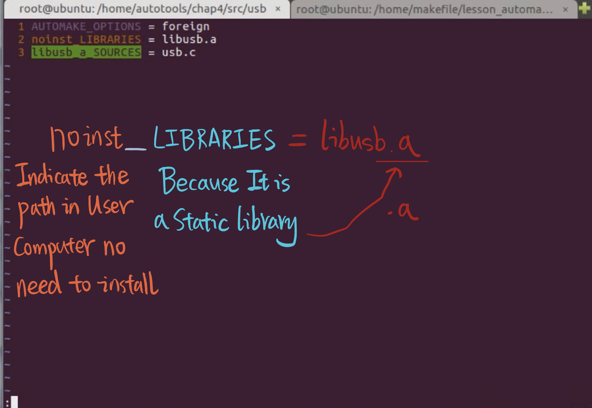
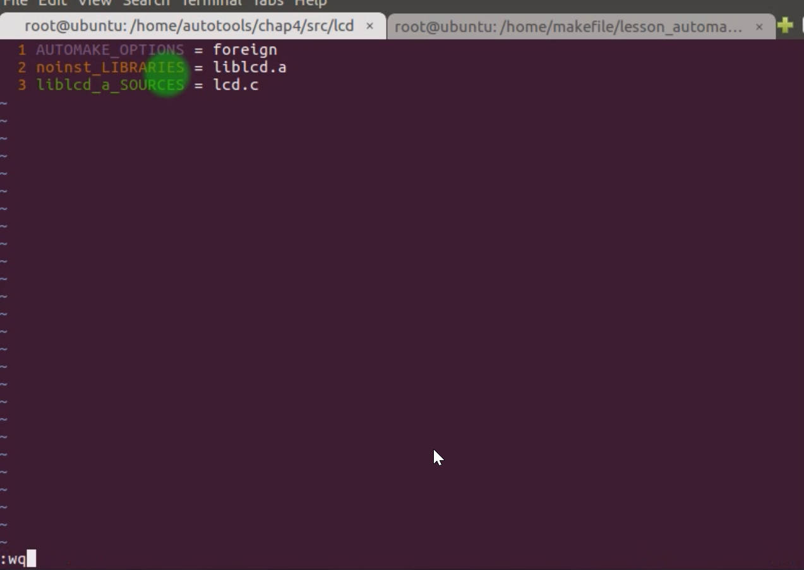

# 4.4 Makefile of shallow directory structure

## Target

Generation and use of static libraries

Compilation of Makefile.am for each directory

Recursively  compile the dictionary using **SUBDIRS**

## Configure.ac


./configure detect the each Makefile.am in each child work directory, to make Makefile file.

# Makefile.am in Root Work Directory

Touch a new makefile.am as total command in /chap4/Makefile.am as following:

```
AUTOMAKEFILE_OPTIONS = foreign

SUBDIRS = src
```

**SUBFIRS** parameter: The Makefile will automatically recursively process every file to make a Makefile in /chap4/src

# Makefile.am in each Child Work Directory

Manually create the Makefile.am in each Child Work Directory which needed to be make






