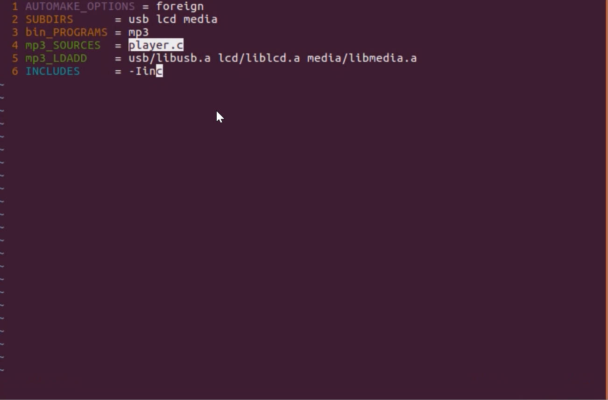
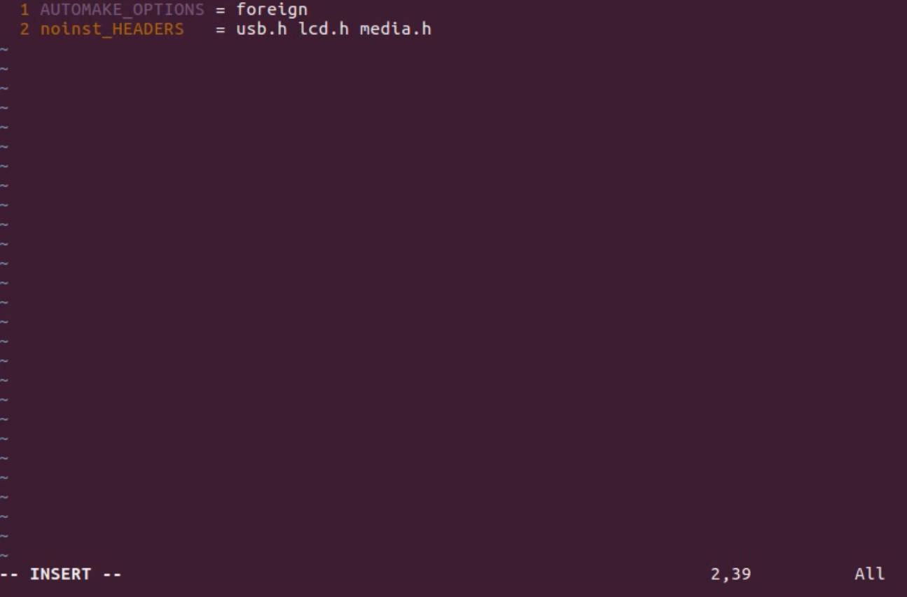

# 4.5 Header file management, path specification, and impact on dependencies

Make a new directory in rsc fold as rsc/inc, put all existed .h files into there.

New dependence tree, all .h saved into a specified directory named **/inc**

Open the src/Makefile.am, use INCLUDES to tell program where to find those .h files.

## New Question: When use make dist to distribute the program, the .h files are not in the package.

这是因为在rsc/inc目录里面没有makefile.am文件为编译操作make提供指令而导致的缺少目标操作，make指令在编译时候没有看到相应目录下的make操作，故省略了这些.h文件.

This is because there is no makefile.am file in the rsc/inc directory to provide instructions for the compilation operation make, resulting in the lack of target operations. The make instruction does not see the make operation in the corresponding directory during compilation, so these .h files are omitted.

**Solution**: add Makefile.am file manually into the /rsc/inc dictionary

