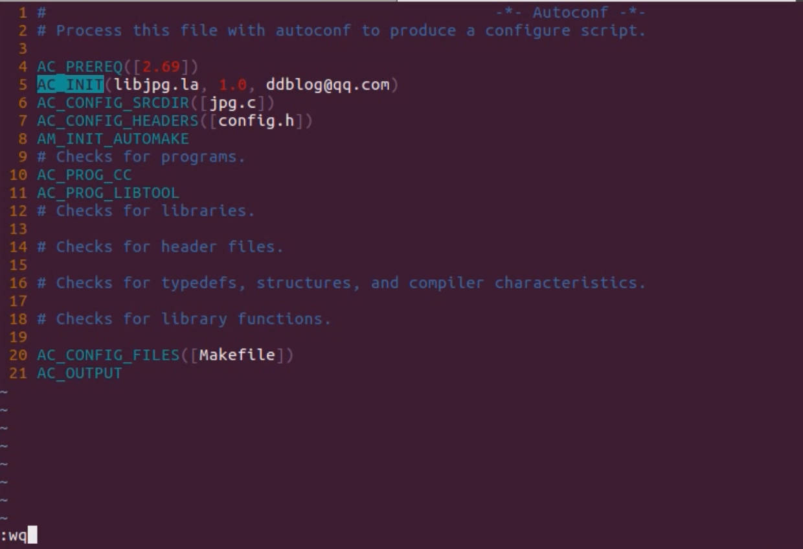

# 4.7 Use libtool to build a dynamic link library

## Introduction to Libtool

Different Unix platforms, compilation, naming and management of shared libraries in different ways

Some platforms support dynamic loading, some platforms provide other mechanisms, some do not provide

Libtool abstracts the library, generates .la extension form, and supports different platforms

### Libtool

Including libtoolize and libtool

• Before using libtool, use libtoolize to generate **localized libtool**

## 使用Libtool生成动态链接库

## Use Libtool to generate a dynamic link library

### flags of libtool

**-- tag** 

**-- model**

| Compile Language | Tag  |
| ---------------- | ---- |
| C                | CC   |
| C++              | CXX  |
| JAVA             | GCJ  |
| Go               | GO   |
| Fortran 77       | FC   |
| Fortran 77       | F77  |

| -- model option | Explain                                                   |
| --------------- | --------------------------------------------------------- |
| compile         | Compile a source file to a Libtool object file            |
| link            | Generate a library or executable                          |
| install         | Install a library or executable                           |
| execute         | Run the executable and automatically set the library path |
| uninstall       | Uninstall library                                         |
| clean           | Clean the generated files from build directory            |
| finish          | Complete the installation of the Libtool library file     |

## Scenario 1

In a fold /jpg which has a file named jpg.c stored all details of a jpg, I wanna compile the jpg.c to make a dynamic library which can be shared by all thread.

In different compile system, I must run the following commands to generate the dynamic library of jpg.c and load it to the memory.

```
gcc -fPIC -o jpg.o -c jpg.c
gcc -shared -o libjpg.so jpg.o ## Generate the object .o then generate the DLL
```

But I want it can be loaded directly into the usr/lib when we install the install package contain the dynamic libraries, So users will no need to run those commands upwards by themselves.


## Solution: Use libtool to solve


The libjpg.la is a dynamic library which has the common use attribute and can be used as dynamic library regardless difference compile platform.

## Other example


## Makefile.am for /jpg


```
autoscan
mv configure.scan configure.ac
vi configure.ac
```




```
autoconf
libtoolize --automake ## This is important we must local the libtool
automake
```


