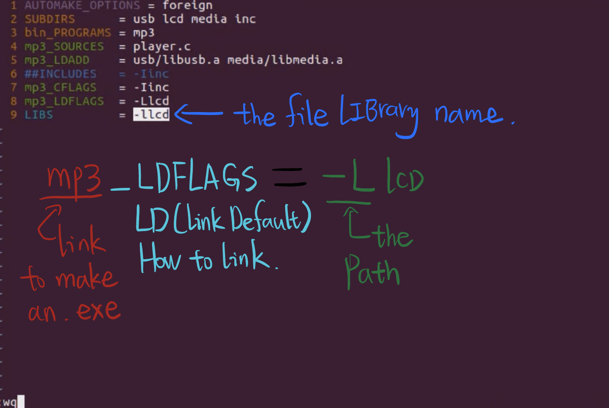
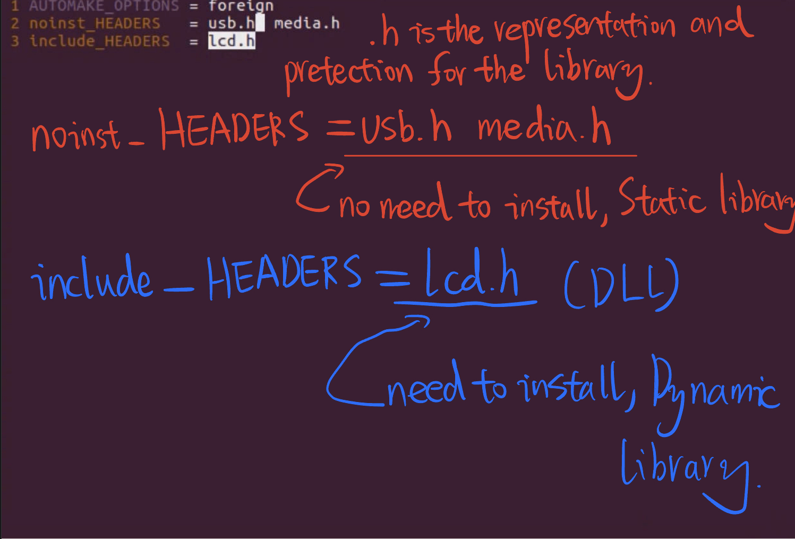
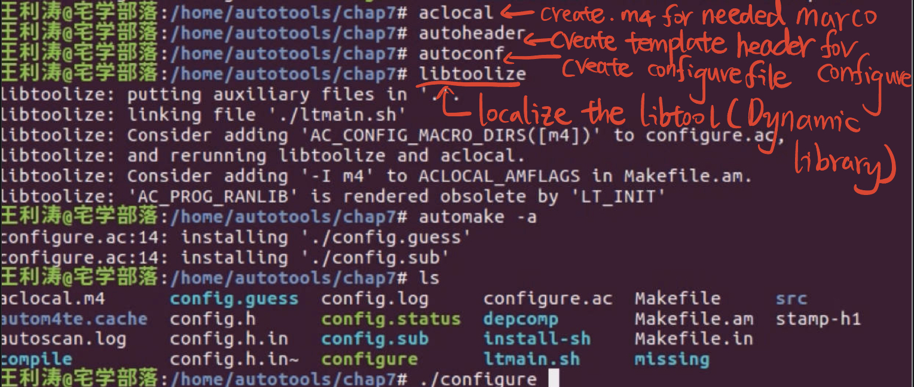
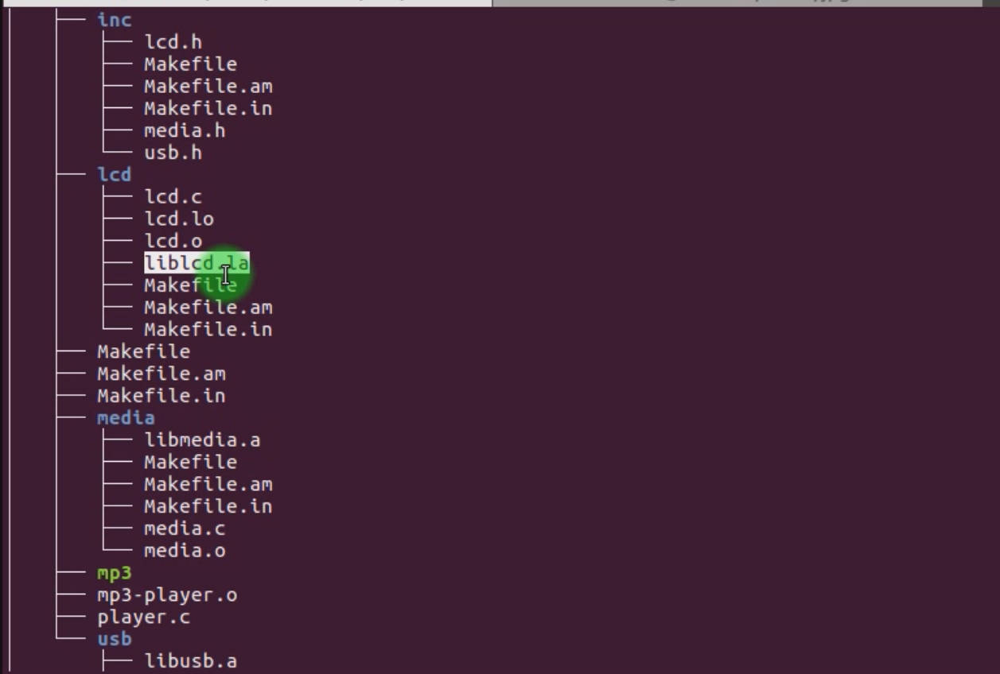

# 4.7.1 Use libtool to create a dynamic library for /lcd

How to use the Dynamic library.

This is used to link the DLL library under /src/lcd to link together with other .o, finally generate the mp3 exe.

**Because I have set the /lcd to generate a Dynamic library, the inc/Makefile.am must be reparse, due to the player.c need to include the .h file, and now liblcd.la is a dynamic library, I need to tell the compile to install the DLL to the /usr/local/lib**

**因为主程序player.c在使用的时候要调用这个动态库liblcd.a，头文件lcd.h是这个动态库的封装形式，所以我需要修改src/lcd/Makefile.am里面的代码，告诉编译器这个动态库需要在编译的时候安装到/usr/local/lib**

## Make the Makefile

Compilation 

Result:

