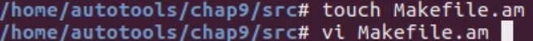
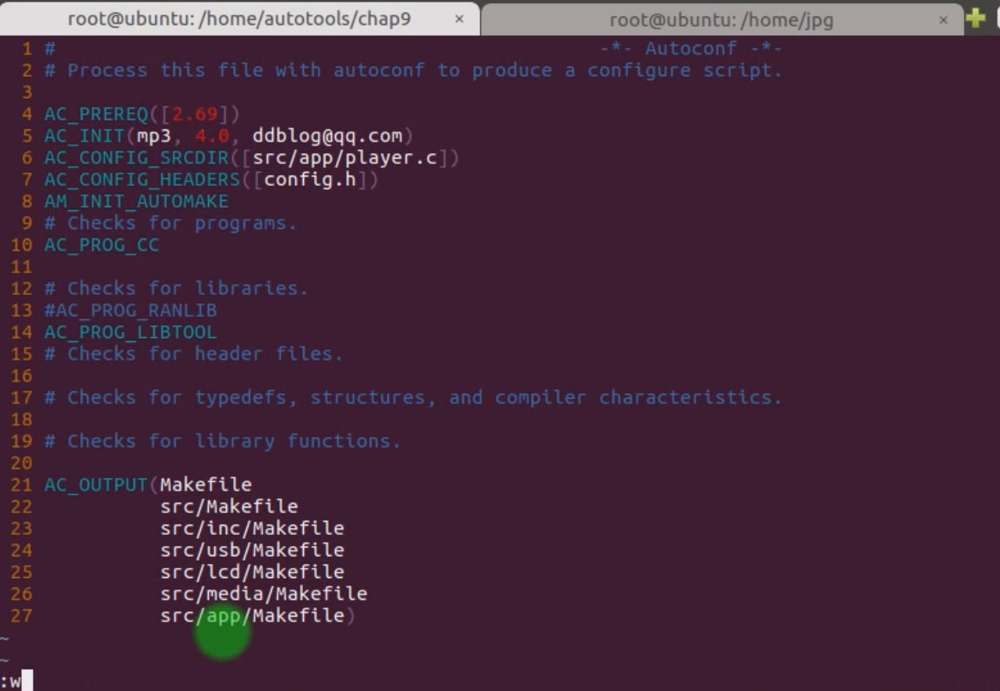
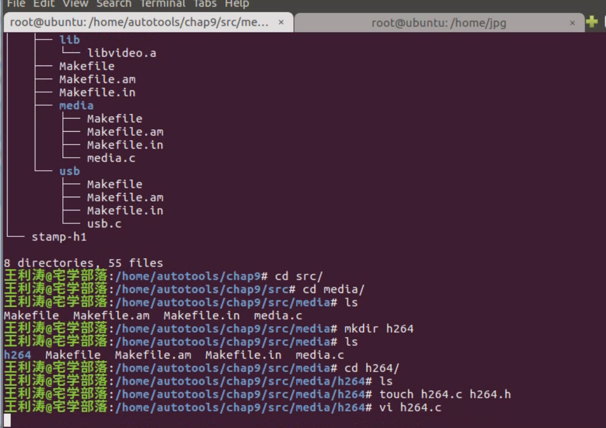
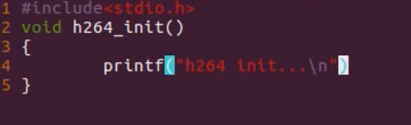
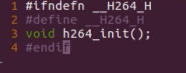
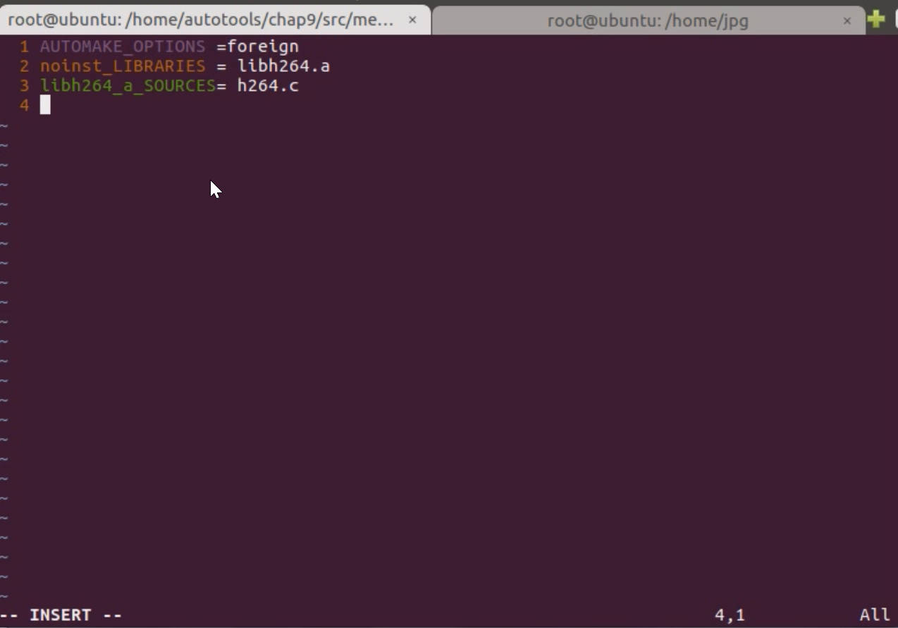
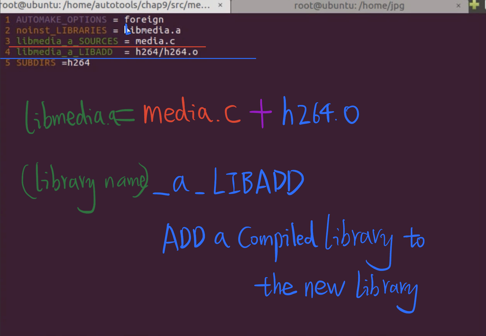
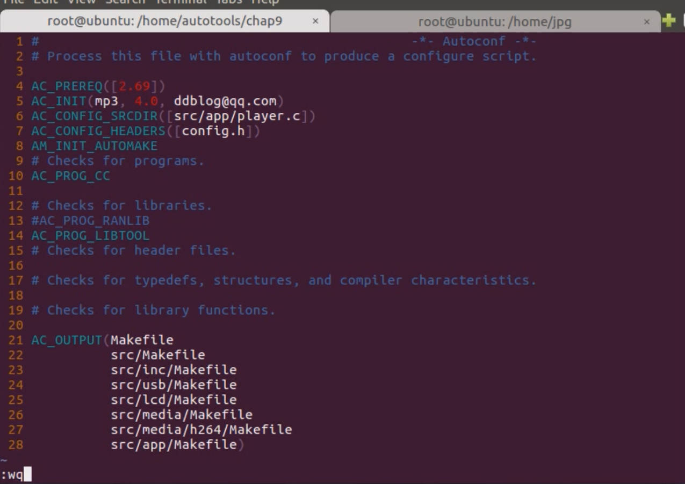
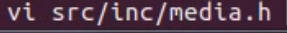
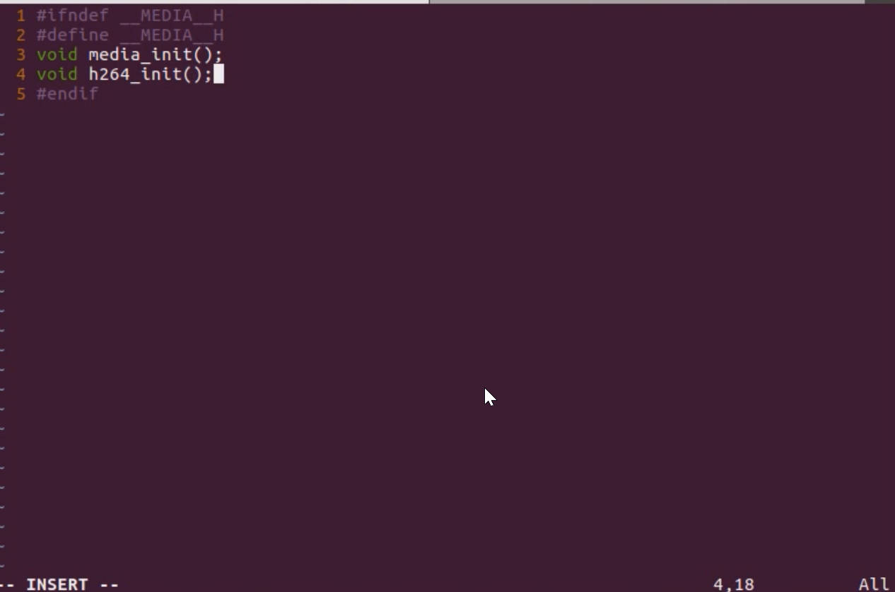

# 4.9 Makefile of deep directory structure, multi-directory construction of library

The filesystem structure of current file system (Shallow)

Make a new folder under /src as /app, administrating the main files.

Move /src/player.c and /src/Makefile.am into the /app folder.

After move the Makefile.am to the /src/app, There must have a Makefile.am under /src to tell the compile where to find the /src/app/Makefile.am

 

Adjust the configure.ac after modifying the Makefile.am

## Adjust the /src/media, add new feature h264

Use SUBDIRS variable to tell the file to find the Makefile.am which under /h264

 Adjust the **configure.ac** to detect the new added library's Makefile.am to generate a new Makefile

**Media.h** adding the new feature to ready for call

