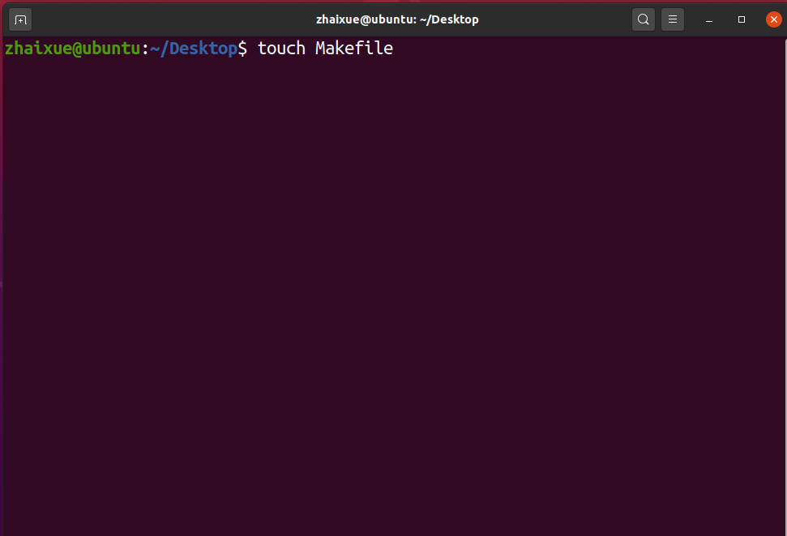
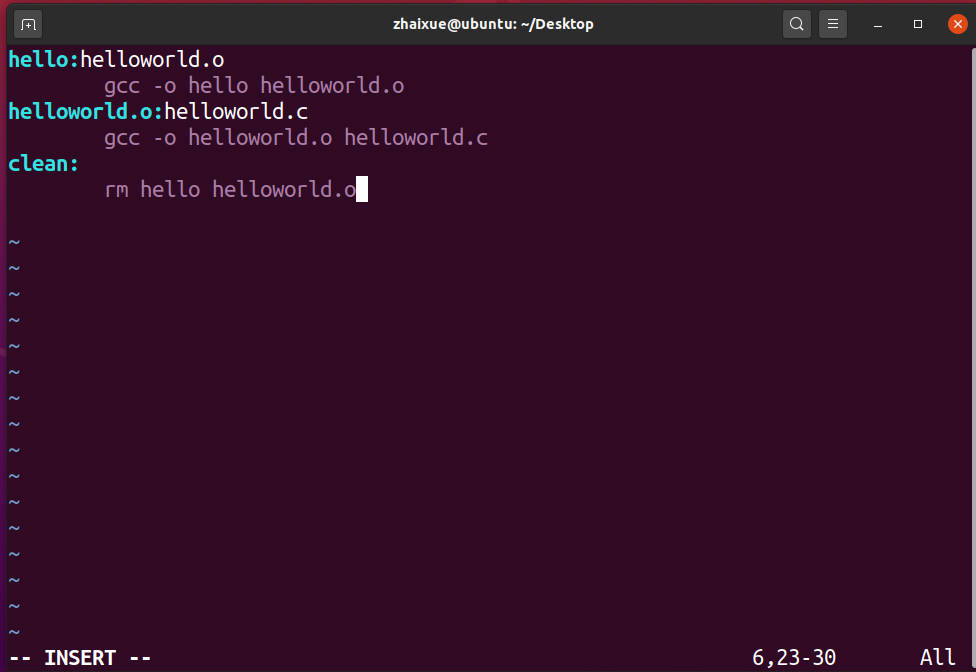

# Makefile to defines set of tasks to be executed

Create a Makefile to add commands to the sets of files

The usage of Makefile

* Description the whole project compile
* The project automatically compile

The logic of the Makefile compile process

